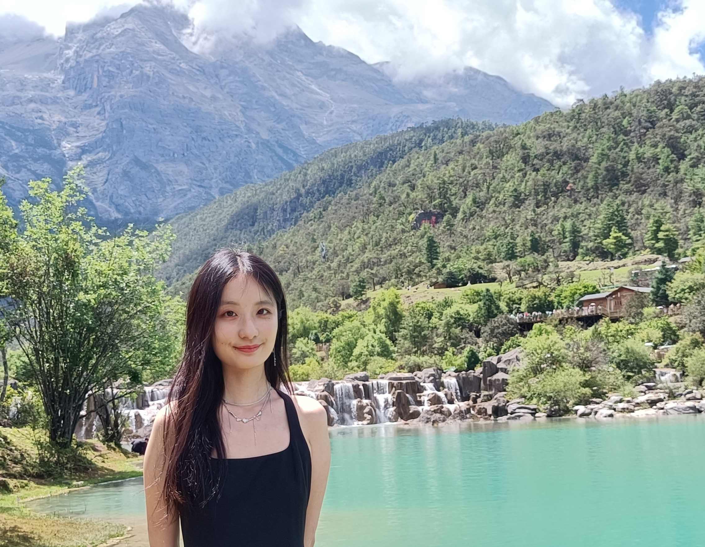

# About Mes

Here is **Katherine Zhang (张思雨)**.I am a graduate student majoring in Communication.My research interests are centered on the intersection of **Technology, Communication, and Society**. Within this interdisciplinary field, my work primarily focuses on two key areas:

## 1. Technology and Public Discourse

I investigate the impact of technology on public discourse, with a specific focus on how networked publics interpret news events and how digital platforms and other new communication methods are reshaping the dynamics of public information.

## 2. Misinformation in the Age of AI

I am dedicated to understanding **the emerging forms of misinformation** that arise from AI technologies. My research examines:
- The characteristics and dissemination of visual misinformation
- The effects of such messages and individual perceptions
- Potential strategies for mitigating these issues through corrections and fact-checking messages

I am **theoretically-driven**. In my research, I adopt theoretical insights from cognitive theory, social psychology, and communication science. I apply **computational method** and **qualitative (survey and experiment) methods** to investigate the above research area.

## Contact

If you are interested in any aspect of my work, I would love to chat and collaborate. Please email me at [zsyalicia@163.com](mailto:zsyalicia@163.com).

## Academic Background

- **Sep 2022 - June 2025:** Sichuan International Studies University (MA, Communication)
- **Sep 2018 - June 2022:** China University of Labor Relations (BA, Journalism)
- **Sep 2020 - June 2021:** Renmin University of China (Exchange student)

## News and Updates

- **Mar 2024：**One paper accepted to ICA 2024.
- **Oct 2023：**Happy to be awarded the National Graduate Scholarship.
- **Jan 2023：**One paper accepted to IAMCR 2023.

## Hobbies

### Running and Boxing

-I enjoyed long-distance running and boxing.They remove my worries, refreshes my body, and brings me courage to address any challenges.

### Playing Drums

-I recently developed a hobby of playing drums. I find it super cool, and playing drums allows me to immerse myself in music. Maybe in the future, I’ll even try performing in a live band!

### Taking a walk randomly
-I know it's strange. But it really helps clear and mind.
